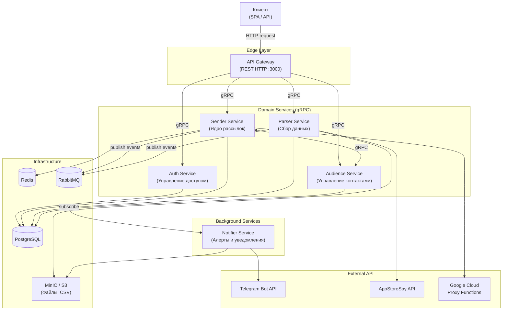
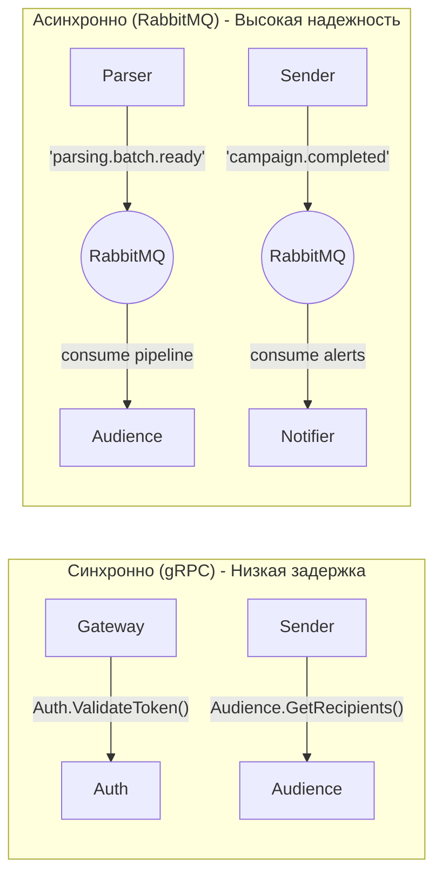
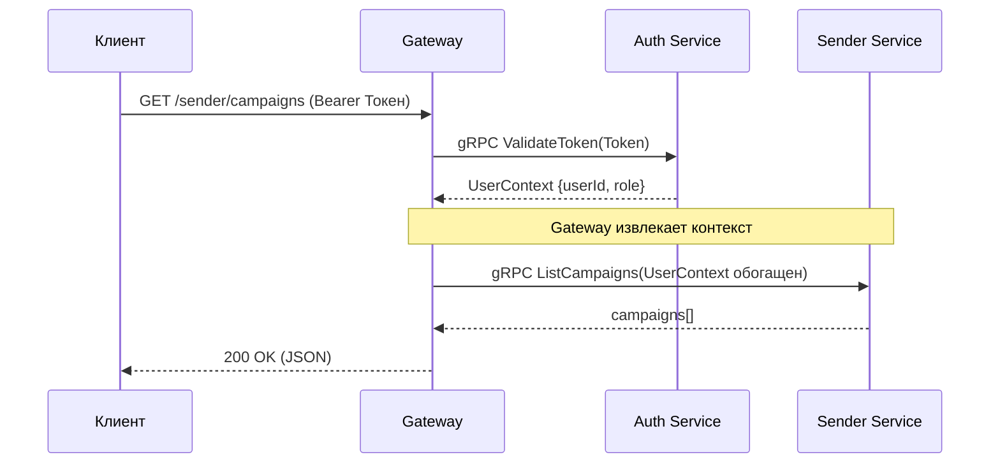
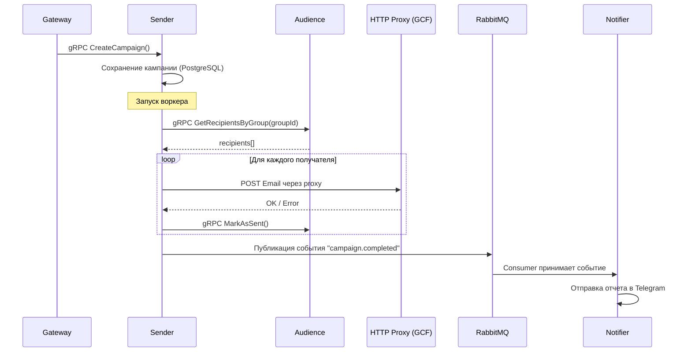
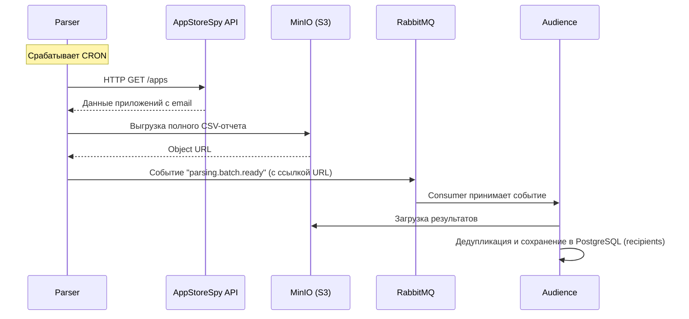

# Архитектура Платформы Email-Рассылок
> Презентация инфраструктуры и взаимодействия микросервисов

---

## 1. Введение и Общая концепция

Платформа представляет собой высоконагруженную систему для парсинга контактов и массовых email-рассылок.
Для обеспечения масштабируемости, отказоустойчивости и независимости команд разработки выбрана **Микросервисная архитектура**.

**Ключевые технологии:**
- **Кодовая база:** Monorepo (Turborepo), TypeScript
- **Фреймворк:** NestJS (Node.js)
- **Точка входа:** API Gateway (REST HTTP)
- **Внутренний транспорт:** gRPC (синхронно) и RabbitMQ (асинхронно/события)
- **Базы данных и хранилища:** PostgreSQL (с Drizzle ORM), Redis, MinIO (S3)

---

## 2. Предпосылки к переходу (Проблемы монолита)

Предыдущая LTS-архитектура была представлена монолитом, что несло архитектурные риски:
- **Отсутствие SRP:** Код разных доменов (рассылки, парсинг) был перемешан, зоны ответственности размыты.
- **Отсутствие изоляции (Tight Coupling):** Прямые вызовы между модулями позволяли изменениям в одной части неявно ломать логику другой.
- **Единая база данных:** Все модули делили одну СУБД (риск каскадных блокировок).
- **Смешение ресурсов:** Тяжелые фоновые задачи (парсинг) находились в одном Event Loop с REST API, что создавало риски просадки ответов пользователям.
- **Хрупкие интеграции:** Синхронные вызовы внешних API блокировали процессы при нестабильности от сторонних серверов.

---

## 3. Высокоуровневая схема инфраструктуры

Точкой входа в систему является **API Gateway**, который принимает HTTP-запросы от клиентов и проксирует их внутренним сервисам. Nginx упразднен в угоду упрощения маршрутизации.

---

## 4. Взаимодействие сервисов

В системе используется два основных паттерна взаимодействия, что позволяет балансировать между скоростью ответа клиенту и надежностью фоновых процессов.

### 4.1. Синхронное взаимодействие (gRPC)
Используется там, где клиенту или другому сервису ответ нужен немедленно. Отличается высокой скоростью благодаря протоколу HTTP/2 и бинарной сериализации Protobuf.
- Gateway ➔ Auth: `ValidateToken()` для верификации доступа к защищенным маршрутам.
- Gateway ➔ Sender: `CreateCampaign()` для создания рассылки пользователем.
- Sender ➔ Audience: `GetRecipientsByGroup()` для получения контактов перед началом отправки писем.

### 4.2. Асинхронное взаимодействие (RabbitMQ)
Используется для уведомлений, передачи данных и фоновых процессов (Fire-and-Forget, Data Transfer). Позволяет снять нагрузку с синхронного канала.
- Sender ➔ `campaign.completed` (Event) ➔ Notifier (Отправка отчета в Telegram).
- Parser ➔ `parsing.batch.ready` (Event) ➔ Audience (Асинхронный импорт новых спарсенных контактов в базу Audience).

---

## 5. Архитектура данных

Каждый микросервис **полностью контролирует и владеет своими данными**. Прямой доступ одних сервисов к базам данных других сервисов категорически запрещен (базы логически разделены).

| Тип БД / Хранилища | Сервис | Назначение (Таблицы, pgSchema per service) |
| :--- | :--- | :--- |
| **PostgreSQL** | **Auth** | Пользователи (`users`), сессии/токены (`refresh_tokens`) — pgSchema `auth` |
| **PostgreSQL** | **Sender** | Кампании (`campaigns`), Воркеры (`runners`), Письма (`messages`), Макросы (`macros`) — pgSchema `sender` |
| **PostgreSQL** | **Parser** | Настройки парсинга (`parser_tasks`, `parser_settings`), Использованные параметры — pgSchema `parser` |
| **PostgreSQL** | **Audience**| Адресаты (`recipients`), Группы рассылки (`recipient_groups`) — pgSchema `audience` |
| **Redis** | **Sender** | Кэширование, BullMQ (очереди воркеров для рассылки) |
| **RabbitMQ** | **Все** | Exchange для топиков событий (`events`), Очереди консьюмеров |
| **MinIO (S3)** | **Parser / Notifier**| Экспорт CSV, логи, хранение объемных результатов между сервисами |

---

## 6. Бизнес-потоки (Data Flows)

Рассмотрим несколько ключевых сценариев взаимодействия от конца до конца.

### 6.1 Токен и Аутентификация
Любой защищенный запрос валидируется через Auth сервис перед тем, как Gateway проксирует его целевому сервису.

### 6.2 Жизненный цикл рассылки
Демонстрирует работу Sender сервиса совместно с Audience (получение адресатов) и внешними прокси сервисами.

### 6.3 Сбор аудитории (Парсинг)
Иллюстрирует асинхронную передачу тяжелых объемов данных через событие, совмещенное со ссылкой на S3 хранилище (Claim Check Pattern).

---

## 7. Как микросервисы решили проблемы

Новая архитектура вводит строгие контракты и физическое разделение:
1. **Строгие границы (SRP):** Сервисы (Sender, Parser) полностью независимы. Они общаются исключительно через утвержденные gRPC-контракты.
2. **Изоляция данных (Database per Service):** Каждый сервис владеет только своей БД, что навсегда исключает пересечение логики таблиц.
3. **Изоляция ресурсов:** Ресурсоемкие сервисы выведены в отдельные контейнеры и не конкурируют за процессорное время с Gateway (REST API).
4. **Асинхронность и очереди:** RabbitMQ забирает на себя тяжелые и нестабильные фоновые интеграции (алерты), гарантируя доставку и не блокируя основной поток кода микросервисов.

---

## 8. Внутренняя архитектура сервисов (Clean / Hexagonal)

Внутри каждого сервиса изолированно и строго соблюдается **Hexagonal Architecture (Ports and Adapters)**, разделяющая бизнес-логику от транспортного и инфраструктурного слоя.

```mermaid
graph TB
    subgraph "Infrastructure Layer (Фреймворки, БД)"
        REST["REST Controller (Gateway)"]
        GRPC_IN["gRPC Server (Inbound Adapter)"]
        GRPC_OUT["gRPC Client (Outbound Adapter)"]
        RABBIT["RabbitMQ Pub/Sub"]
        PG_REPO["PostgreSQL Repositories (Drizzle)"]
    end

    subgraph "Application Layer (Оркестрация Use Cases)"
        UC["Use Cases (Сценарии использования)"]
        IP["Inbound Ports (Интерфейсы входа)"]
        OP["Outbound Ports (Интерфейсы выхода)"]
    end

    subgraph "Domain Layer (Бизнес-ядро)"
        ENT["Entities (Сущности)"]
        VO["Value Objects"]
        DS["Domain Services"]
    end

    GRPC_IN -.implements.-> IP
    REST -.implements.-> IP

    IP --> UC
    UC --> OP
    UC --> ENT
    UC --> DS

    GRPC_OUT -.implements.-> OP
    RABBIT -.implements.-> OP
    PG_REPO -.implements.-> OP

    style ENT fill:#2d5a27,stroke:#4caf50
    style DS fill:#2d5a27,stroke:#4caf50
    style UC fill:#1a3a5c,stroke:#2196f3
    style IP fill:#1a3a5c,stroke:#2196f3
    style OP fill:#1a3a5c,stroke:#2196f3
```

**Ключевые принципы реализации кода микросервисов:**
1. **Dependency Inversion (Инверсия зависимостей):** Бизнес-логика (Domain/Application) не знает о существовании баз данных (PostgreSQL), транспортов (gRPC/RabbitMQ) или веб-фреймворка (NestJS). Она зависит исключительно от абстракций (Ports).
2. **Изоляция и Тестируемость:** Замена источника данных или добавление нового интерфейса (CLI) требует лишь написания нового адаптера (Adapter). Код бизнес-сценариев и бизнес-сущностей не затрагивается.
3. **Чистые доменные объекты:** Сущности в слое Domain состоят исключительно из чистых TypeScript-классов со свойствами и поведением предметной области. Использование ORM декораторов в домене недопустимо.
