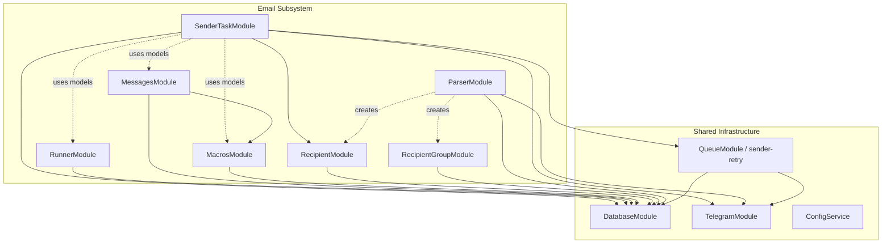

# Анализ подсистемы Email-рассылки для извлечения

> **Примечание (v2.0):** Данный документ описывает legacy-монолит. В текущей микросервисной архитектуре (v2.0) MongoDB заменена на PostgreSQL + Drizzle ORM с pgSchema-изоляцией per service. Все 9 MongoDB-коллекций мигрированы в PostgreSQL-таблицы.

> Цель: полная инвентаризация всего кода, моделей, бизнес-процессов, конфигурации и инфраструктуры, связанных с email-рассылкой, для последующего выделения в отдельный сервис.

---

## 1. Границы подсистемы

### Модули, принадлежащие подсистеме (целиком)

| # | Модуль | Путь | Назначение |
|---|--------|------|------------|
| 1 | **SenderTaskModule** | `src/sender-task/` | Оркестрация рассылок (cron, отправка, retry) |
| 2 | **RunnerModule** | `src/runner/` | CRUD email-аккаунтов + WebSocket таймеры |
| 3 | **MessagesModule** | `src/messages/` | CRUD шаблонов писем + разовая отправка |
| 4 | **MacrosModule** | `src/macros/` | CRUD переменных для рандомизации + Handlebars |
| 5 | **RecipientModule** | `src/recipient/` | CRUD получателей + импорт |
| 6 | **RecipientGroupModule** | `src/recipient-group/` | CRUD групп получателей |
| 7 | **ParserModule** | `src/parser/` | Парсинг AppStoreSpy → импорт recipients |

### Части shared-модулей, используемые подсистемой

| Модуль | Путь | Что используется |
|--------|------|-----------------|
| **QueueModule** | `src/queue/` | Очередь `sender-retry` + `SenderRetryWorker` |
| **TelegramModule** | `src/telegram/` | Отправка алертов о рассылке |
| **DatabaseModule** | `src/database/` | 7 из 27 Mongoose-провайдеров |

---

## 2. Файловая карта (все файлы подсистемы)

### SenderTask

```
src/sender-task/
├── sender-task.module.ts          — Импорты: DatabaseModule, HttpModule, TelegramModule, QueueModule
├── sender-task.controller.ts      — REST API: CRUD задач, toggle active
├── sender-task.service.ts         — Cron (*/3 * * * *), оркестрация отправки, retry
├── dto/
│   └── create-sender-task.dto.ts  — Валидация
└── utils/
    └── updateMessageByMacros.ts   — Handlebars рендер (дубликат логики из MacrosService)
```

### Runner

```
src/runner/
├── runner.module.ts               — Импорты: DatabaseModule
├── runner.controller.ts           — REST API: CRUD, available-list
├── runner.service.ts              — Бизнес-логика: доступность, привязка к задачам
├── runner.gateway.ts              — WebSocket (namespace: /runners): real-time таймеры cooldown
└── types/
    └── index.ts                   — GetRunnersQuery тип (используется ПОВСЕМЕСТНО!)
```

> [!WARNING]
> Тип `GetRunnersQuery` из `src/runner/types` импортируется модулями `Messages`, `Macros`, `Parser`, `SenderTask` — это shared-тип для пагинированных запросов, не специфичный для runners.

### Messages

```
src/messages/
├── messages.module.ts             — Импорты: DatabaseModule; Providers: MacrosService
├── messages.controller.ts         — REST API: CRUD, import, send-once
├── messages.service.ts            — Логика: create, import, sendOnceMessage
└── dto/
    ├── create-message.dto.ts
    └── send-once.dto.ts
```

### Macros

```
src/macros/
├── macros.module.ts               — Импорты: DatabaseModule
├── macros.controller.ts           — REST API: CRUD, test, check-duplicate
├── macros.service.ts              — Handlebars компиляция, рандом из tags
├── dto/
│   ├── create-macros.dto.ts
│   └── test-macros.dto.ts
└── types/
    └── update-message-by-macros.ts
```

### Recipient

```
src/recipient/
├── recipient.module.ts            — Импорты: DatabaseModule
├── recipient.controller.ts        — REST API: import, reset, delete
├── recipient.service.ts           — Импорт emails, reset статусов, удаление
└── dto/
    └── import-recipients.dto.ts   — { emails: string[], group: string }
```

### RecipientGroup

```
src/recipient-group/
├── recipient-group.module.ts      — Импорты: DatabaseModule
├── recipient-group.controller.ts  — REST API: CRUD
├── recipient-group.service.ts     — CRUD групп
└── dto/
    └── create-recipient-group.dto.ts
```

### Parser

```
src/parser/
├── parser.module.ts               — Импорты: DatabaseModule, TelegramModule
├── parser.controller.ts           — REST API: CRUD задач, export
├── parser.service.ts              — Cron (*/1 * * * *), оркестрация парсинга
├── helpers/
│   ├── parser-helper.service.ts   — Основная логика: fetch → filter → import
│   ├── appstorespy.service.ts     — HTTP-клиент к AppStoreSpy API
│   └── csv.service.ts             — Экспорт результатов в CSV
└── dto/
    ├── add-parser-task.dto.ts
    ├── get-used-parameters.dto.ts
    └── update-parser-task-status.dto.ts
```

### Queue (sender-retry)

```
src/queue/
├── queue.module.ts                — ⚠ SHARED — содержит 4 очереди, только sender-retry относится к подсистеме
├── sender-retry.worker.ts         — BullMQ worker: retry отправки с cooldown-логикой
└── types/
    └── sender-retry.types.ts      — SenderRetryJobData, SenderRetryResult
```

---

## 3. MongoDB-коллекции (схемы)

> **Примечание:** В текущей микросервисной архитектуре MongoDB заменена на PostgreSQL + Drizzle ORM с pgSchema-изоляцией per service.

| # | Коллекция | Схема | Путь |
|---|-----------|-------|------|
| 1 | `sendertasks` | SenderTask | `src/database/schemas/sender-task.model.ts` |
| 2 | `senderrunners` | SenderRunner | `src/database/schemas/sender-runner.model.ts` |
| 3 | `messages` | Message | `src/database/schemas/message.model.ts` |
| 4 | `macros` | Macros | `src/database/schemas/macros.model.ts` |
| 5 | `senderrecipients` | Recipient | `src/database/schemas/recipient.model.ts` |
| 6 | `recipientgroups` | RecipientGroup | `src/database/schemas/recipientGroup.model.ts` |
| 7 | `parserTasks` | Parser | `src/database/schemas/parser.model.ts` |
| 8 | `parserusedparameters` | ParserUsedParameters | `src/database/schemas/parser-used-parameters.model.ts` |
| 9 | `parsersettings` | ParserSettings | `src/database/schemas/parser-settings.model.ts` |

### Providers (из `database/providers/index.providers.ts`)

Из 27 провайдеров, **9 принадлежат подсистеме**:

```typescript
ProvidersDB.SENDER_TASK        → SenderTaskSchema     → 'sendertasks'
ProvidersDB.SENDER_RUNNERS     → SenderRunnerSchema   → 'senderrunners'
ProvidersDB.MESSAGES           → MessageSchema        → 'messages'
ProvidersDB.MACROS             → MacrosSchema         → 'macros'
ProvidersDB.RECIPIENT          → RecipientSchema      → 'senderrecipients'
ProvidersDB.RECIPIENT_GROUP    → RecipientGroupSchema  → 'recipientgroups'
ProvidersDB.PARSER             → ParserSchema         → 'parserTasks'
ProvidersDB.PARSER_USED_PARAMETERS → ParserUsedParametersSchema
ProvidersDB.PARSER_SETTINGS    → ParserSettingsSchema
```

### Зависимость от чужих коллекций

| Чужая коллекция | Кто использует | Зачем |
|-----------------|---------------|-------|
| `users` (User) | Все модули | Получение `organization`, `team`, `role` для фильтрации по доступу |

---

## 4. Граф зависимостей



---

## 5. Бизнес-процессы

### Процесс 1: Парсинг контактов

```
Медиабайер → POST /parser/add-task
  { category, maxInstall, release_date[], groupName, appPublished }
      ↓
Cron (*/1 * * * *) → ParserService.parserCron()
  • Берёт до 4 активных задач (MAX_CONCURRENT_TASKS = 4)
  • Помечает inProgress=true
      ↓
ParserHelperService.processParser()
  • Разбивает даты на полумесячные интервалы
  • Проверяет ParserUsedParameters (дедупликация)
  • Запрашивает AppStoreSpy API (по 1000 записей)
  • Фильтрует: только с email
  • Батчами по 100 создаёт Recipients в группе
  • Сохраняет CSV (all + filtered) в csv_exports/
  • Telegram: "Task completed. Added: N"
  • Отправляет CSV-файлы в Telegram
```

### Процесс 2: Массовая рассылка

```
Медиабайер → POST /sender-task/create
  { taskName, groups[], runners[], messages[], proxied, sendControlEmail }
      ↓
Cron (*/3 * * * *) → SenderTaskService.senderTaskCron()
  • Только в production (NODE_ENV check)
  • Находит active=true задачи с непустыми groups
      ↓
Для каждой задачи:
  1. Загружает macros организации
  2. Находит recipients со status=false в указанных группах
  3. Если recipients=0 → markTaskAsCompleted (active=false, Telegram alert)
  4. Проверяет доступность runners (spammed=false, cooldown прошёл)
      ↓
Для каждого recipient:
  1. Случайный Message из messages[]
  2. Handlebars рендер (подстановка macros + системных переменных)
  3. Берём следующий runner (shift — однократное использование за цикл)
  4. Отправка:
     • proxied=true → случайный Cloud Function → runner.webhook
     • proxied=false → напрямую runner.webhook
  5. Успех:
     • recipient.status=true, runnerID, messageID записываются
     • runner.lastRun=now, runCount++
     • task.lettersSent++
     • group.count++
     • Каждые 100 писем → контрольное письмо на SENDER_CONTROL_MAIL
  6. Ошибка:
     • Добавляется job в sender-retry (BullMQ)
     • delay: 2мин, attempts: 10, removeOnComplete/Fail: true
  7. Ошибка в macros:
     • Telegram: "😱 Caught error with macro..."
     • task.active=false (деактивация)
```

### Процесс 3: Retry-механизм

```
BullMQ sender-retry queue
  ↓
SenderRetryWorker.process(job)
  1. Проверяет существование задачи
  2. Проверяет доступность ВСЕХ runners задачи (не только исходного)
  3. Если исходный runner недоступен → использует первый доступный
  4. Дополнительная проверка cooldown для выбранного runner
  5. Повторная отправка (через proxy или напрямую)
  6. Успех → обновление recipient, runner, task, group
  7. Ошибка + <10 попыток → retry (BullMQ backoff)
  8. Ошибка + 10 попыток → Telegram alert + recipient.isSentError=true
```

### Процесс 4: Разовая отправка

```
POST /messages/send-once
  { runnerID, recipient, message, title, senderName, proxied }
  ↓
MessagesService.sendOnceMessage()
  • Находит runner
  • MacrosService.updateMessageByMacros() — рендерит шаблон
  • Отправляет через proxy или напрямую
```

### Процесс 5: WebSocket мониторинг

```
WS: /runners namespace
  ↓
Client → emit("join", { userId, page, limit })
  ↓
RunnerGateway:
  • Запрашивает runners с пагинацией (по роли пользователя)
  • Рассчитывает remainingTime до окончания cooldown
  • setInterval(1s) → emit("remainingTimes") клиенту
  • Когда все таймеры = 0 → emit("allTimersFinished")
```

---

## 6. Внешние интеграции

### AppStoreSpy API

| Параметр | Значение |
|----------|----------|
| URL | `https://api.appstorespy.com/v1/play/apps/query` |
| Auth | Header `API-KEY` из env `APPSTORESPY_API_KEY` |
| Retry | 3 попытки, delay 5s × (attempt+1) |
| Batch | 1000 записей на страницу |

### Google Cloud Function Proxies

```typescript
// ХАРДКОЖЕНЫ в коде (дублируются в SenderTaskService и SenderRetryWorker!)
PROXY_FUNCTIONS = [
    { name: "proxyfunction",  url: "https://europe-west10-my-wallet-333322.cloudfunctions.net/proxyfunction" },
    { name: "senderproxy",    url: "https://senderproxy-154435987813.europe-west10.run.app" },
    { name: "senderproxy2",   url: "https://senderproxy2-154435987813.us-central1.run.app" },
    { name: "serverproxy1",   url: "https://serverproxy1-154435987813.europe-west10.run.app" },
    { name: "senderproxy3",   url: "https://senderproxy3-154435987813.europe-west10.run.app" },
];
```

### Telegram Bot API

| Использование | Bot Token (env) | Chat ID (env) |
|--------------|-----------------|---------------|
| Алерты рассылки | `SENDER_TG_BOT_SHARED_KEY` | `SENDER_TG_BOT_CHAT_ID` |

Операции: `sendMessageToChat()`, `sendDocument()` (CSV-файлы парсера)

---

## 7. Переменные окружения

### Специфичные для подсистемы

| Переменная | Используется в | Назначение |
|-----------|----------------|------------|
| `SENDER_TG_BOT_SHARED_KEY` | SenderTaskModule, ParserModule | Telegram bot token |
| `SENDER_TG_BOT_CHAT_ID` | SenderTaskService, SenderRetryWorker, ParserHelperService | Telegram chat ID для алертов |
| `SENDER_CONTROL_MAIL` | SenderTaskService | Email для контрольных писем (каждые 100) |
| `APPSTORESPY_API_KEY` | AppstorespyService | API-ключ AppStoreSpy |
| `NODE_ENV` | SenderTaskService | Cron рассылки только в production |

### Shared (нужны для работы, но принадлежат монолиту)

| Переменная | Назначение |
|-----------|------------|
| `DATABASE_URL` | PostgreSQL connection (was MongoDB in legacy) |
| `REDIS_HOST`, `REDIS_PORT` | BullMQ broker |
| `JWT_ACCESS_SECRET` | Валидация токенов в AuthGuard |

---

## 8. Cron-задачи

| Cron | Модуль | Метод | Периодичность |
|------|--------|-------|---------------|
| `*/3 * * * *` | SenderTaskService | `senderTaskCron()` | Каждые 3 мин |
| `*/1 * * * *` | ParserService | `parserCron()` | Каждую минуту |

Оба cron-а запускаются через `node-cron` в `onModuleInit()`. Не через NestJS `@Cron()` декоратор.

---

## 9. REST API эндпоинты подсистемы

### SenderTask (`/sender-task`)

| Метод | Путь | Назначение |
|-------|------|------------|
| POST | `/` | Список задач (пагинация) |
| POST | `/create` | Создать задачу |
| PUT | `/update/:id` | Обновить задачу |
| PATCH | `/status/:id` | Включить/выключить (active) |
| DELETE | `/:id` | Удалить задачу |

### Runner (`/runner`)

| Метод | Путь | Назначение |
|-------|------|------------|
| POST | `/` | Список runners (пагинация) |
| POST | `/create` | Создать runner |
| PUT | `/update/:id` | Обновить runner |
| PATCH | `/update-status/:id` | Переключить spammed |
| DELETE | `/:id` | Удалить runner |
| GET | `/list` | Все runners (без пагинации) |
| GET | `/available-list` | Свободные runners |

### Messages (`/messages`)

| Метод | Путь | Назначение |
|-------|------|------------|
| POST | `/` | Список сообщений (пагинация) |
| POST | `/create` | Создать шаблон |
| POST | `/import` | Массовый импорт |
| POST | `/send-once` | Разовая отправка |
| GET | `/list` | Все сообщения (без пагинации) |
| PUT | `/update/:id` | Обновить |
| DELETE | `/delete/:id` | Удалить |

### Macros (`/macros`)

| Метод | Путь | Назначение |
|-------|------|------------|
| POST | `/` | Список макросов (пагинация) |
| POST | `/create` | Создать макрос |
| POST | `/check-duplicate` | Проверка дубликатов |
| POST | `/test` | Тестовый рендер |
| GET | `/names` | Список имён макросов |
| PATCH | `/update/:id` | Обновить |
| DELETE | `/delete/:id` | Удалить |

### Recipient (`/recipients`)

| Метод | Путь | Назначение |
|-------|------|------------|
| POST | `/import` | Импорт получателей |
| PATCH | `/reset-status` | Сбросить статусы (status → false) |
| DELETE | `/:id` | Удалить получателя |

### RecipientGroup (`/recipient-group`)

| Метод | Путь | Назначение |
|-------|------|------------|
| POST | `/` | Список групп (пагинация) |
| POST | `/create` | Создать группу |
| PUT | `/update/:id` | Обновить |
| DELETE | `/:id` | Удалить |

### Parser (`/parser`)

| Метод | Путь | Назначение |
|-------|------|------------|
| POST | `/` | Список задач парсера |
| POST | `/add-task` | Создать задачу парсинга |
| POST | `/update-status/:id` | Обновить статус |
| POST | `/unused-dates` | Неиспользованные параметры |
| PUT | `/update-task/:id` | Обновить задачу |
| GET | `/categories` | Категории AppStoreSpy |
| GET | `/unique-dates` | Уникальные даты |
| GET | `/export-phone-numbers/:date` | Экспорт телефонов |
| DELETE | `/:id` | Удалить задачу |

### WebSocket Gateway

| Namespace | Событие | Направление |
|-----------|---------|-------------|
| `/runners` | `join` | Client → Server |
| `/runners` | `updatePagination` | Client → Server |
| `/runners` | `leave` | Client → Server |
| `/runners` | `remainingTimes` | Server → Client |
| `/runners` | `allTimersFinished` | Server → Client |

---

## 10. Дублирование кода

> [!CAUTION]
> Обнаружены серьёзные дубликаты, которые нужно устранить при извлечении.

| Дубликат | Файл 1 | Файл 2 |
|----------|--------|--------|
| `PROXY_FUNCTIONS` массив (5 URL) | `sender-task.service.ts:26-47` | `sender-retry.worker.ts:21-42` |
| Логика проверки cooldown runner | `sender-task.service.ts:192-212` | `sender-retry.worker.ts:93-113` |
| Логика обновления после отправки (recipient, runner, task, group) | `sender-task.service.ts:316-362` | `sender-retry.worker.ts:189-218` |
| `updateMessageByMacros` (Handlebars рендер) | `sender-task/utils/updateMessageByMacros.ts` | `macros.service.ts:116-155` |
| Proxy URL | `messages.service.ts:173` (хардкод одного proxy) | `sender-task.service.ts` (массив 5) |

---

## 11. Shared-зависимости от монолита

### Модель User

Все модули подсистемы инжектят `ProvidersDB.USER_PROVIDER` для:
- Определения `organization` и `team` при создании записей
- Фильтрации данных по ролям (`UserRole.ADMIN`, `MODERATOR`, `TEAM_LEAD`, `USER`)

### AuthGuard

Все контроллеры защищены `AuthGuard` — проверка JWT/static token. При извлечении нужна своя аутентификация или gateway-прокси.

### fetchPaginatedResults

Утилита `src/utils/fetchPaginatedResults.ts` используется в:
- `SenderTaskService`, `RunnerService`, `MessagesService`, `MacrosService`, `ParserService`, `RecipientGroupService`

### GetRunnersQuery

Тип `src/runner/types/index.ts` используется универсально для пагинации, несмотря на название "Runners".

### ProvidersDB enum

`src/common/enums/db.enum.ts` — единый enum токенов для DI.

---

## 12. Что остаётся в монолите

При извлечении подсистемы, в монолите **НЕ затрагиваются**:

| Модуль | Причина |
|--------|---------|
| Apps | Никак не связан с рассылкой |
| Domains | Независимый модуль |
| Snapshot | Про наши приложения, не про рассылку |
| Keitaro | Трекинг, не рассылка |
| AppsFlyer | Атрибуция, не рассылка |
| OneSignal | Push-уведомления, другой канал |
| Affise | Партнёрская программа |
| Auth / User | Общая инфраструктура |

### Что потребует изменений в монолите

1. **`app.module.ts`** — убрать импорты: `SenderTaskModule`, `RunnerModule`, `MessagesModule`, `MacrosModule`, `RecipientModule`, `RecipientGroupModule`, `ParserModule`
2. **`queue.module.ts`** — убрать очередь `sender-retry` и `SenderRetryWorker`
3. **`database/providers/index.providers.ts`** — убрать 9 провайдеров
4. **`database/schemas/`** — убрать 9 файлов схем

---

## 13. Рекомендации для извлечения

### Границы нового сервиса

```
Email Sender Service
├── API Layer (REST + WebSocket)
│   ├── /sender-tasks
│   ├── /runners
│   ├── /messages
│   ├── /macros
│   ├── /recipients
│   ├── /recipient-groups
│   ├── /parser
│   └── WS: /runners
├── Business Layer
│   ├── Sending Engine (cron + orchestration)
│   ├── Retry Engine (BullMQ worker)
│   ├── Template Engine (Handlebars + Macros)
│   ├── Parser Engine (AppStoreSpy client)
│   └── Notification Service (Telegram alerts)
├── Data Layer
│   ├── 9 PostgreSQL tables (migrated from MongoDB collections)
│   ├── Redis (BullMQ broker)
│   └── File storage (CSV exports)
└── External
    ├── AppStoreSpy API
    ├── Google Cloud Function proxies
    ├── Runner webhooks (email delivery)
    └── Telegram Bot API
```

### Точки интеграции с монолитом

| Зависимость | Решение при извлечении |
|-------------|----------------------|
| User (role, organization, team) | API-вызов к монолиту или общая БД (read-only) |
| AuthGuard (JWT) | Общий JWT-секрет или API Gateway |
| Shared MongoDB | Выделить 9 коллекций в отдельную БД |
| Shared Redis | Отдельный Redis-инстанс для BullMQ |

---

## 14. Следующие шаги

> **Статус (v2.0):** Шаги 1-5 выполнены. Микросервисная архитектура реализована с Clean/Hexagonal Architecture, PostgreSQL + Drizzle ORM, gRPC-контрактами и Docker-инфраструктурой.

На следующих фазах (после согласования архитектуры):
1. **Архитектурное проектирование** — Clean Architecture, SOLID, GRASP, DDD/Hexagonal -- DONE (v1.0)
2. **Определение bounded contexts** — Parser, Sender, Campaign Management -- DONE (v1.0)
3. **Проектирование контрактов** — API между новым сервисом и монолитом -- DONE (v1.0, gRPC proto)
4. **Миграция данных** — стратегия переноса 9 MongoDB-коллекций в PostgreSQL -- DONE (v2.0, Drizzle ORM)
5. **Инфраструктура** — Docker, CI/CD, мониторинг для нового сервиса -- DONE (v2.0, docker-compose)
