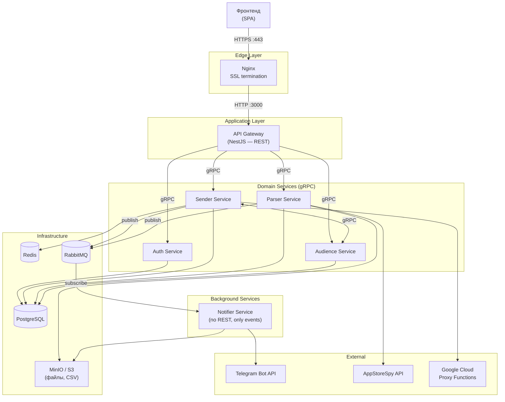
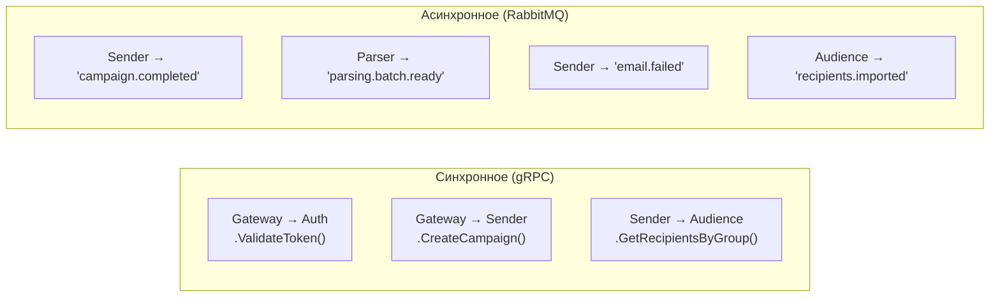
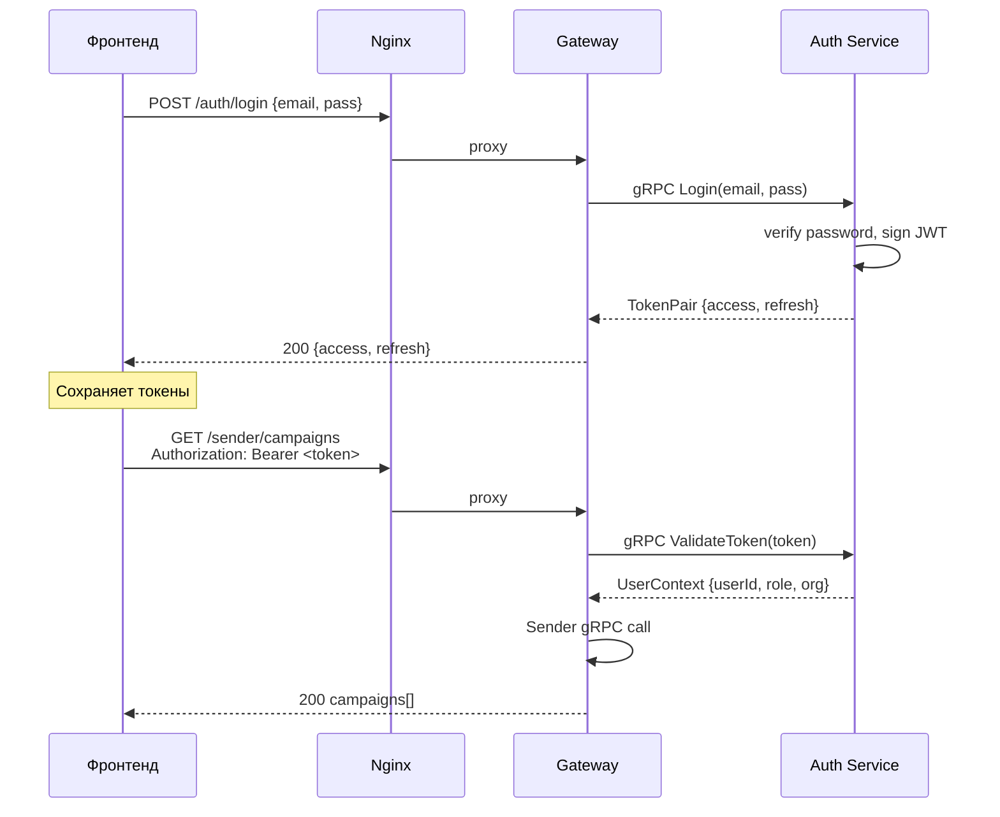
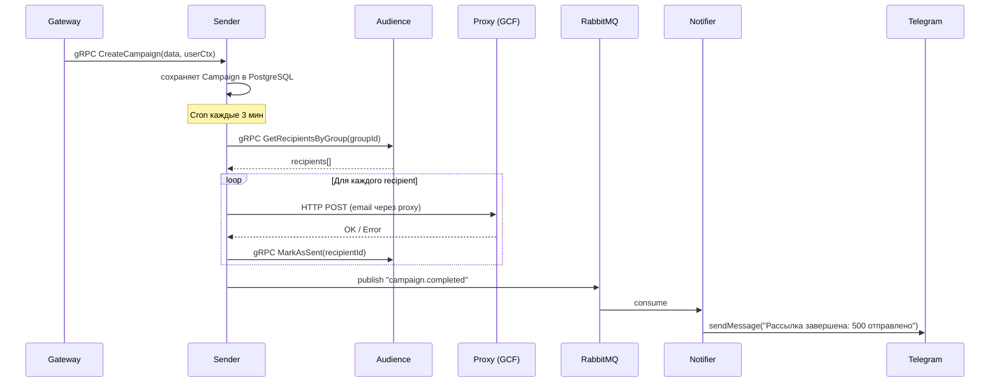
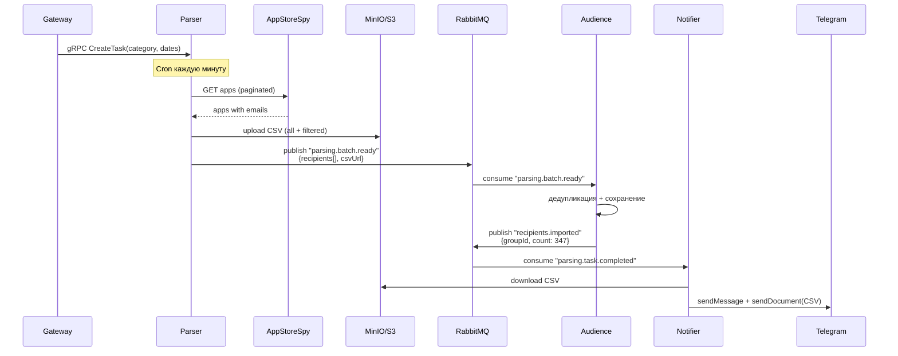

# Целевая архитектура: Email Platform

> Микросервисы в монорепе с Clean Architecture / Hexagonal Architecture

---

## 1. Общая схема системы



---

## 2. Сервисы и ответственности

| Сервис | Транспорт | Отвечает за | Таблицы PostgreSQL (pgSchema) |
|--------|-----------|-------------|-------------------------------|
| **Gateway** | REST (наружу) → gRPC (внутрь) | Маршрутизация, аутентификация (через Auth) | — |
| **Auth** | gRPC | Users, login, token issue/refresh/validate/revoke | `auth.users`, `auth.refresh_tokens` |
| **Sender** | gRPC | Campaigns, Runners, Messages, Macros | `sender.campaigns`, `sender.runners`, `sender.messages`, `sender.macros` |
| **Parser** | gRPC | Парсинг AppStoreSpy, cron задачи, CSV экспорт | `parser.parser_tasks`, `parser.parser_settings` |
| **Audience** | gRPC | Recipients, RecipientGroups, импорт/экспорт | `audience.recipients`, `audience.recipient_groups` |
| **Notifier** | RabbitMQ (consumer) | Telegram, Email уведомления, отправка файлов | — |

---

## 3. Коммуникация

### 3.1 Типы взаимодействий



| Паттерн | Когда | Транспорт | Пример |
|---------|-------|-----------|--------|
| **Request-Response** | Нужен ответ немедленно | gRPC | Gateway → Auth.ValidateToken() |
| **Fire-and-Forget** | Уведомление, не нужен ответ | RabbitMQ | Sender → "campaign.completed" → Notifier |
| **Data Transfer** | Передача данных между доменами | RabbitMQ + S3 | Parser → CSV в S3 → event → Audience |

### 3.2 Карта взаимодействий

```
Gateway:
  → Auth.ValidateToken()        gRPC sync     каждый protected запрос
  → Auth.Login()                gRPC sync     POST /auth/login
  → Auth.RefreshToken()         gRPC sync     POST /auth/refresh
  → Sender.*                    gRPC sync     /sender/* роуты
  → Parser.*                    gRPC sync     /parser/* роуты
  → Audience.*                  gRPC sync     /audience/* роуты

Sender:
  → Audience.GetRecipients()    gRPC sync     при запуске рассылки
  → Audience.MarkAsSent()       gRPC sync     после отправки
  → "campaign.completed"       RabbitMQ       рассылка завершена
  → "email.failed"             RabbitMQ       письмо не отправлено
  → "campaign.progress"        RabbitMQ       прогресс рассылки

Parser:
  → "parsing.batch.ready"      RabbitMQ       пачка recipients готова
  → "parsing.task.completed"   RabbitMQ       задача парсинга завершена
  → S3: upload CSV             HTTP           файлы результатов

Audience:
  ← "parsing.batch.ready"      RabbitMQ       получает recipients от Parser
  → "recipients.imported"      RabbitMQ       recipients сохранены

Notifier:
  ← "campaign.completed"       RabbitMQ       → Telegram + Email
  ← "parsing.task.completed"   RabbitMQ       → Telegram + CSV файл
  ← "email.failed"             RabbitMQ       → Telegram алерт
  ← "recipients.imported"      RabbitMQ       → Telegram: "добавлено N"
  ← S3: download CSV           HTTP           скачивает файлы для отправки
```

---

## 4. Слои внутри каждого сервиса (Hexagonal Architecture)

```mermaid
graph TB
    subgraph "Infrastructure Layer"
        REST["REST Controller<br/>(только Gateway)"]
        GRPC_IN["gRPC Server<br/>(inbound adapter)"]
        GRPC_OUT["gRPC Client<br/>(outbound adapter)"]
        RABBIT_PUB["RabbitMQ Publisher<br/>(outbound adapter)"]
        RABBIT_SUB["RabbitMQ Subscriber<br/>(inbound adapter)"]
        PG_REPO["PostgreSQL Repository (Drizzle)<br/>(outbound adapter)"]
        EXT["External API Client<br/>(outbound adapter)"]
    end

    subgraph "Application Layer"
        UC["Use Cases"]
        IP["Inbound Ports<br/>(interfaces)"]
        OP["Outbound Ports<br/>(interfaces)"]
    end

    subgraph "Domain Layer"
        ENT["Entities"]
        VO["Value Objects"]
        DE["Domain Events"]
        DS["Domain Services"]
    end

    GRPC_IN -->|implements| IP
    RABBIT_SUB -->|implements| IP
    REST -->|implements| IP

    IP --> UC
    UC --> OP
    UC --> ENT
    UC --> DS

    GRPC_OUT -->|implements| OP
    RABBIT_PUB -->|implements| OP
    PG_REPO -->|implements| OP
    EXT -->|implements| OP

    style ENT fill:#2d5a27,stroke:#4caf50
    style VO fill:#2d5a27,stroke:#4caf50
    style DE fill:#2d5a27,stroke:#4caf50
    style DS fill:#2d5a27,stroke:#4caf50
    style UC fill:#1a3a5c,stroke:#2196f3
    style IP fill:#1a3a5c,stroke:#2196f3
    style OP fill:#1a3a5c,stroke:#2196f3
```



### Правило зависимостей

```
Infrastructure → Application → Domain
     ↓                ↓            ↓
  Adapters         Use Cases    Entities
  (знают о          (знают о    (0 зависимостей,
   фреймворках)      портах)     чистая логика)
```

> [!IMPORTANT]
> **Domain Layer НЕ импортирует ничего из Application и Infrastructure.**
> **Application Layer НЕ импортирует ничего из Infrastructure.**
> Зависимости направлены только ВНУТРЬ (Dependency Inversion Principle).

---

## 5. Структура Sender Service (пример)

```
apps/sender/
├── src/
│   ├── domain/
│   │   ├── entities/
│   │   │   ├── campaign.entity.ts          ← SenderTask → Campaign
│   │   │   ├── runner.entity.ts
│   │   │   └── email-message.entity.ts
│   │   ├── value-objects/
│   │   │   ├── email-address.vo.ts
│   │   │   ├── sending-interval.vo.ts
│   │   │   └── cooldown-timer.vo.ts
│   │   ├── events/
│   │   │   ├── campaign-completed.event.ts
│   │   │   └── email-send-failed.event.ts
│   │   └── services/
│   │       └── sending-strategy.service.ts  ← выбор proxy, cooldown
│   │
│   ├── application/
│   │   ├── ports/
│   │   │   ├── inbound/
│   │   │   │   ├── create-campaign.port.ts
│   │   │   │   ├── execute-campaign.port.ts
│   │   │   │   └── retry-email.port.ts
│   │   │   └── outbound/
│   │   │       ├── campaign-repository.port.ts
│   │   │       ├── runner-repository.port.ts
│   │   │       ├── email-gateway.port.ts       ← "отправить письмо"
│   │   │       ├── recipient-provider.port.ts  ← "получить recipients"
│   │   │       ├── event-publisher.port.ts     ← "опубликовать событие"
│   │   │       └── job-queue.port.ts           ← "поставить в очередь"
│   │   └── use-cases/
│   │       ├── create-campaign.use-case.ts
│   │       ├── execute-campaign.use-case.ts
│   │       ├── retry-failed-email.use-case.ts
│   │       └── get-campaign-status.use-case.ts
│   │
│   ├── infrastructure/
│   │   ├── grpc/
│   │   │   └── sender.grpc-server.ts           ← inbound adapter
│   │   ├── persistence/
│   │   │   ├── pg-campaign.repository.ts        ← outbound adapter (Drizzle)
│   │   │   └── pg-runner.repository.ts
│   │   ├── messaging/
│   │   │   ├── rabbitmq-event.publisher.ts      ← outbound adapter
│   │   │   └── bullmq-job.queue.ts              ← outbound adapter
│   │   ├── external/
│   │   │   └── proxy-email.gateway.ts           ← outbound adapter
│   │   └── clients/
│   │       └── audience.grpc-client.ts          ← outbound adapter
│   │
│   ├── sender.module.ts                         ← DI wiring
│   └── main.ts                                  ← bootstrap gRPC server
│
├── Dockerfile
├── .env.development
└── package.json
```

---

## 6. Структура монорепы

```
email-platform/
├── apps/
│   ├── gateway/                 ← REST → gRPC трансляция
│   │   ├── src/
│   │   │   ├── controllers/     ← REST endpoints
│   │   │   ├── guards/          ← AuthGuard (→ gRPC → Auth)
│   │   │   ├── interceptors/    ← logging, error handling
│   │   │   └── main.ts
│   │   └── Dockerfile
│   │
│   ├── auth/                    ← Users + Tokens
│   │   ├── src/
│   │   │   ├── domain/
│   │   │   ├── application/
│   │   │   └── infrastructure/
│   │   └── Dockerfile
│   │
│   ├── sender/                  ← Рассылка
│   │   └── (см. раздел 5 выше)
│   │
│   ├── parser/                  ← Парсинг контактов
│   │   ├── src/
│   │   │   ├── domain/
│   │   │   ├── application/
│   │   │   └── infrastructure/
│   │   └── Dockerfile
│   │
│   ├── audience/                ← Recipients + Groups
│   │   ├── src/
│   │   │   ├── domain/
│   │   │   ├── application/
│   │   │   └── infrastructure/
│   │   └── Dockerfile
│   │
│   └── notifier/                ← Telegram + Email alerts
│       ├── src/
│       │   ├── domain/
│       │   ├── application/
│       │   └── infrastructure/
│       └── Dockerfile
│
├── packages/
│   ├── contracts/               ← gRPC proto + events + shared DTOs
│   │   ├── proto/
│   │   │   ├── auth.proto
│   │   │   ├── sender.proto
│   │   │   ├── parser.proto
│   │   │   └── audience.proto
│   │   ├── events/
│   │   │   ├── sender.events.ts
│   │   │   ├── parser.events.ts
│   │   │   └── audience.events.ts
│   │   ├── generated/            ← автогенерация из proto
│   │   └── package.json
│   │
│   └── config/                   ← общие конфиг-паттерны
│       ├── env.validation.ts
│       └── package.json
│
├── infra/
│   ├── docker-compose.yml        ← dev environment
│   ├── docker-compose.prod.yml   ← production overrides
│   └── nginx/
│       └── nginx.conf
│
├── pnpm-workspace.yaml
├── package.json
└── README.md
```

---

## 7. Proto-контракты

### auth.proto

```protobuf
syntax = "proto3";
package auth;

service AuthService {
    rpc Login (LoginRequest) returns (TokenPair);
    rpc RefreshToken (RefreshRequest) returns (TokenPair);
    rpc ValidateToken (ValidateRequest) returns (UserContext);
    rpc RevokeToken (RevokeRequest) returns (Empty);
    rpc CreateUser (CreateUserRequest) returns (User);
    rpc ListUsers (ListUsersRequest) returns (UserList);
}

message UserContext {
    string user_id = 1;
    string role = 2;
    string organization = 3;
    string team = 4;
}

message TokenPair {
    string access_token = 1;
    string refresh_token = 2;
}
```

### sender.proto

```protobuf
syntax = "proto3";
package sender;

service SenderService {
    rpc ListCampaigns (ListRequest) returns (CampaignList);
    rpc CreateCampaign (CreateCampaignRequest) returns (Campaign);
    rpc PauseCampaign (CampaignIdRequest) returns (Campaign);
    rpc ResumeCampaign (CampaignIdRequest) returns (Campaign);
    rpc ListRunners (ListRunnersRequest) returns (RunnerList);
    rpc CreateRunner (CreateRunnerRequest) returns (Runner);
    rpc ListMessages (ListRequest) returns (MessageList);
    rpc CreateMessage (CreateMessageRequest) returns (Message);
    rpc ListMacros (ListRequest) returns (MacrosList);
}
```

### audience.proto

```protobuf
syntax = "proto3";
package audience;

service AudienceService {
    rpc ListGroups (ListGroupsRequest) returns (GroupList);
    rpc CreateGroup (CreateGroupRequest) returns (Group);
    rpc DeleteGroup (GroupIdRequest) returns (Empty);
    rpc ListRecipients (ListRecipientsRequest) returns (RecipientList);
    rpc GetRecipientsByGroup (GetByGroupRequest) returns (RecipientList);
    rpc ImportRecipients (ImportRequest) returns (ImportResult);
    rpc MarkAsSent (MarkSentRequest) returns (Empty);
    rpc ResetSendStatus (ResetRequest) returns (Empty);
}
```

---

## 8. Потоки данных

### 8.1 Аутентификация



### 8.2 Рассылка писем



### 8.3 Парсинг контактов



---

## 9. RabbitMQ: Exchanges и Queues

```
Exchange: "events" (topic)
├── Routing Key                  │ Queue                    │ Consumer
├── sender.campaign.completed   │ notifier.campaign        │ Notifier
├── sender.email.failed         │ notifier.errors          │ Notifier
├── sender.campaign.progress    │ notifier.progress        │ Notifier
├── parser.batch.ready          │ audience.import          │ Audience
├── parser.task.completed       │ notifier.parsing         │ Notifier
└── audience.recipients.imported│ notifier.audience        │ Notifier
```

```typescript
// packages/contracts/events/sender.events.ts

export const SENDER_EVENTS = {
    CAMPAIGN_COMPLETED: 'sender.campaign.completed',
    EMAIL_FAILED: 'sender.email.failed',
    CAMPAIGN_PROGRESS: 'sender.campaign.progress',
} as const;

export interface CampaignCompletedEvent {
    campaignId: string;
    campaignName: string;
    sentCount: number;
    failedCount: number;
    duration: number;
    userId: string;
}

export interface EmailFailedEvent {
    campaignId: string;
    recipientEmail: string;
    error: string;
    attempt: number;
}
```

---

## 10. Infrastructure

### Docker Compose (dev)

```yaml
services:
  nginx:
    image: nginx:alpine
    ports: ["80:80"]
    volumes: [./infra/nginx/nginx.conf:/etc/nginx/nginx.conf]
    depends_on: [gateway]

  gateway:
    build: { context: ., dockerfile: apps/gateway/Dockerfile }
    expose: ["3000"]
    env_file: apps/gateway/.env.development
    depends_on: [auth, sender, parser, audience]

  auth:
    build: { context: ., dockerfile: apps/auth/Dockerfile }
    expose: ["50051"]
    env_file: apps/auth/.env.development
    depends_on: [postgres]

  sender:
    build: { context: ., dockerfile: apps/sender/Dockerfile }
    expose: ["50052"]
    env_file: apps/sender/.env.development
    depends_on: [postgres, redis, rabbitmq]

  parser:
    build: { context: ., dockerfile: apps/parser/Dockerfile }
    expose: ["50053"]
    env_file: apps/parser/.env.development
    depends_on: [postgres, rabbitmq, minio]

  audience:
    build: { context: ., dockerfile: apps/audience/Dockerfile }
    expose: ["50054"]
    env_file: apps/audience/.env.development
    depends_on: [postgres, rabbitmq]

  notifier:
    build: { context: ., dockerfile: apps/notifier/Dockerfile }
    env_file: apps/notifier/.env.development
    depends_on: [rabbitmq, minio]

  postgres:
    image: postgres:16-alpine
    environment:
      POSTGRES_USER: ${POSTGRES_USER:-postgres}
      POSTGRES_PASSWORD: ${POSTGRES_PASSWORD:-postgres}
      POSTGRES_DB: ${POSTGRES_DB:-email_platform}
    volumes: [postgres_data:/var/lib/postgresql/data]

  redis:
    image: redis:7-alpine
    ports: ["6379:6379"]

  rabbitmq:
    image: rabbitmq:3-management
    ports: ["5672:5672", "15672:15672"]
    volumes: [rabbitmq_data:/var/lib/rabbitmq]

  minio:
    image: minio/minio
    command: server /data --console-address ":9001"
    ports: ["9000:9000", "9001:9001"]
    volumes: [minio_data:/data]

volumes:
  postgres_data:
  rabbitmq_data:
  minio_data:
```

### Порты сервисов

| Сервис | REST | gRPC | Примечание |
|--------|------|------|------------|
| Nginx | :80 / :443 | — | Только наружу |
| Gateway | :3000 | — | REST, принимает от Nginx |
| Auth | — | :50051 | Только gRPC |
| Sender | — | :50052 | gRPC + BullMQ worker |
| Parser | — | :50053 | gRPC + Cron |
| Audience | — | :50054 | gRPC + RabbitMQ consumer |
| Notifier | — | — | Только RabbitMQ consumer |
| RabbitMQ | :15672 (UI) | — | :5672 (AMQP) |
| MinIO | :9001 (UI) | — | :9000 (S3 API) |

---

## 11. Принципы и ограничения

### SOLID в действии

| Принцип | Как применяется |
|---------|----------------|
| **SRP** | Каждый сервис — одна ответственность. Auth не шлёт письма. Sender не парсит. |
| **OCP** | Добавить Slack-канал = новый subscriber в Notifier, ничего не меняя в Sender |
| **LSP** | Все adapters заменяемы: MongoRepo → PostgresRepo через один интерфейс |
| **ISP** | Порты минимальны: `EmailGatewayPort` не содержит методов для recipients |
| **DIP** | Use cases зависят от портов (абстракций), не от PostgreSQL/RabbitMQ |

### Архитектурные ограничения

> [!CAUTION]
> 1. **Сервисы НЕ обращаются в чужую БД** — только через gRPC или events
> 2. **Domain Layer НЕ импортирует NestJS** — чистые классы TypeScript
> 3. **Proto файлы — единственный контракт** — без shared business logic
> 4. **Нет циклических зависимостей** между сервисами
> 5. **Gateway НЕ содержит бизнес-логику** — только routing и трансляция
